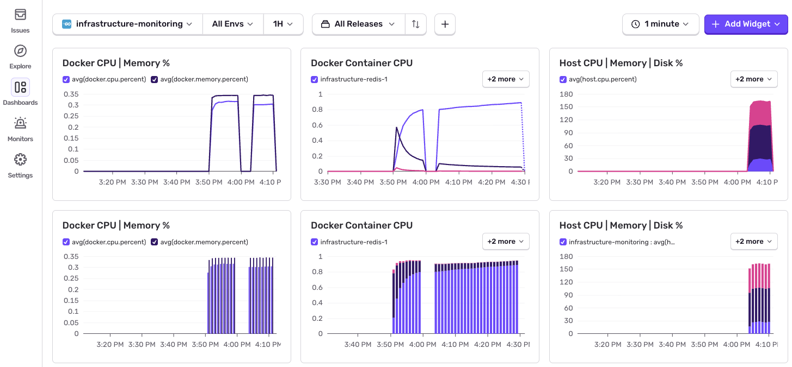

# infrastructure



Collects host metrics (CPU, memory, disk, network) and Docker container stats, then ships them to Sentry as application metrics — using the Sentry SDK directly, with no separate monitoring agent to deploy. See `collectors/` for how it's done via `gopsutil` and the Docker Engine API. There's also a OTel Collector-based [implementation](otel_collector/README.md) available. No Kubernetes support yet in either implementation — that's a real collector/receiver to build, not a config tweak. I'm looking for initial feedback on the current state of this project first.

[Sentry Metrics & Sentry UI](#sentry-metrics--sentry-ui)

[Overhead, Troubleshooting, Security, Roadmap, Sentry Overview in /docs](docs/HANDBOOK.md).

## Setup
```bash
# you'll need a SENTRY_DSN in your .env
# collection interval defaults to 60s — tune it via INTERVAL_SECONDS in .env
go mod tidy
cp .env.example .env
```

## Run

### Run Demo App

`docker-compose.yml` spins up 4 containers: Postgres, Redis, and Nginx as sample workloads to monitor, plus `infra-monitor` — the monitor itself, containerized, watching the other three via the Docker Engine API.

```bash
docker compose up -d --build
```

`infra-monitor` can also be run separately from the 3 sample containers — useful while rebuilding or iterating on it independently:
```bash
docker compose up -d postgres redis nginx
docker compose up -d --build infra-monitor
```

### Run Fleet-Wide

One monitor instance per host, talking to that host's Docker socket and reporting on every container the daemon can see — exactly what the Demo App above does, via `docker-compose.yml`. To run it standalone, outside of Compose:

```bash
docker build -t infrastructure-monitor .
docker run -d --restart unless-stopped \
  --env-file .env \
  -e COLLECTORS=docker \
  -v /var/run/docker.sock:/var/run/docker.sock \
  infrastructure-monitor
```

Two things to know before pointing this at a real environment:
- It has no way to scope to specific containers — it reports on the whole daemon, all or nothing. [Open a GitHub Issue](https://github.com/thinkocapo/infrastructure/issues/new).
- [Security Concern](docs/HANDBOOK.md#security) on mounting '.sock' into the container.

### Run Per-Target

Instead of one monitor watching a whole host's containers, run one monitor instance *inside* each container (or VM) you actually want visibility into, with only the host collector enabled — `gopsutil` just reads `/proc`-level stats for wherever it's running, so it never touches the Docker socket at all. That makes it naturally scoped to exactly one target, with no socket-access question to raise.

Steps:
1. Build the binary (works from source directly — no Docker image needed for this path):
   ```bash
   go build -o infrastructure-monitor .
   ```
2. Copy `infrastructure-monitor` into whatever the target container image already builds (a `COPY` line in your own Dockerfile), or drop it directly onto a VM.
3. Run it alongside the existing process, no Docker dependency at all:
   ```bash
   SENTRY_DSN=... COLLECTORS=host ./infrastructure-monitor
   ```
4. Repeat per container or host that needs visibility. Each instance tags its metrics with its own real hostname, so multiple instances stay distinguishable in the Sentry UI without extra config.

[Security Concern](docs/HANDBOOK.md#security) for the tradeoff between Fleet-Wide and Per-Target.

## Sentry Metrics & Sentry UI

### Source 1: Host (`gopsutil`)

Reads directly from the target's kernel via `gopsutil` — wherever this binary happens to be running (a container, a VM, bare metal). This is the per-target collector described above (`-collectors=host`) — [code](https://github.com/thinkocapo/infrastructure/blob/main/collectors/host.go#L20) where this is set.

`source` is always `gopsutil` for these metrics — it identifies which collector emitted them. `host` is the real hostname of wherever this binary is running, so multiple Per-Target instances stay distinguishable from each other in the Sentry UI.

| Metric | Tags |
|---|---|
| `host.cpu.percent` | `source`, `host` |
| `host.memory.used_mb` | `source`, `host` |
| `host.memory.percent` | `source`, `host` |
| `host.disk.used_gb` | `source`, `host` |
| `host.disk.percent` | `source`, `host` |
| `host.net.bytes_sent_mb` | `source`, `host` |
| `host.net.bytes_recv_mb` | `source`, `host` |

### Source 2: Docker containers (Docker Engine API)

Reads per-container stats from the Docker daemon. Each running container gets its own set of metrics, tagged by container name — [code](https://github.com/thinkocapo/infrastructure/blob/main/collectors/docker.go#L19) where this is set.

`source` is always `docker` for these metrics. `host` is the real hostname of the machine whose Docker daemon is being read (the Fleet-Wide instance doing the watching, not the container being watched). `container` is that container's name, as Docker reports it.

| Metric | Tags |
|---|---|
| `docker.cpu.percent` | `source`, `host`, `container` |
| `docker.memory.used_mb` | `source`, `host`, `container` |
| `docker.memory.percent` | `source`, `host`, `container` |

Docker metrics are skipped gracefully if Docker is not running.